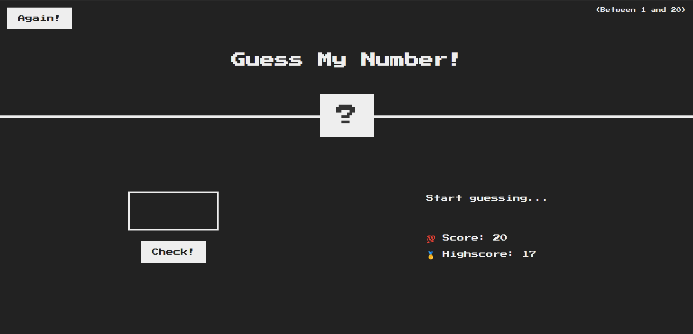
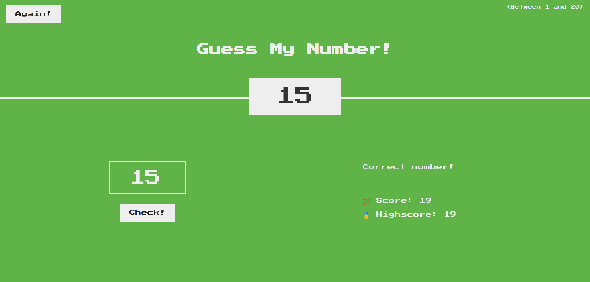
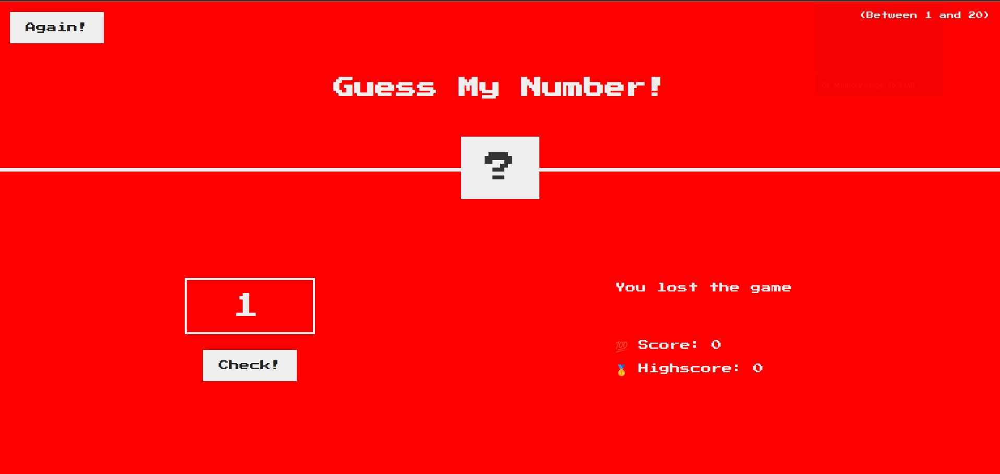

# Game Guess My Number

This is a simple game built using JavaScript where the player tries to guess a randomly generated number within a given range.

## Gameplay

## Winning Scenario

## Losing Scenario

## How to Play

1. Open the `index.html` file in a web browser.
2. Enter your guess in the input field and click the "Check!" button.
3. The game will provide feedback whether your guess is too high or too low.
4. Keep guessing until you correctly guess the number or run out of attempts.

## Features

- Randomly generated number for each game session.
- Interactive user interface with clear instructions.
- Score tracking to keep count of the number of attempts.
- Highscore tracking to record the best score achieved.

## Technologies Used

- HTML
- CSS
- JavaScript

Feel free to explore the code and make any modifications or improvements!
